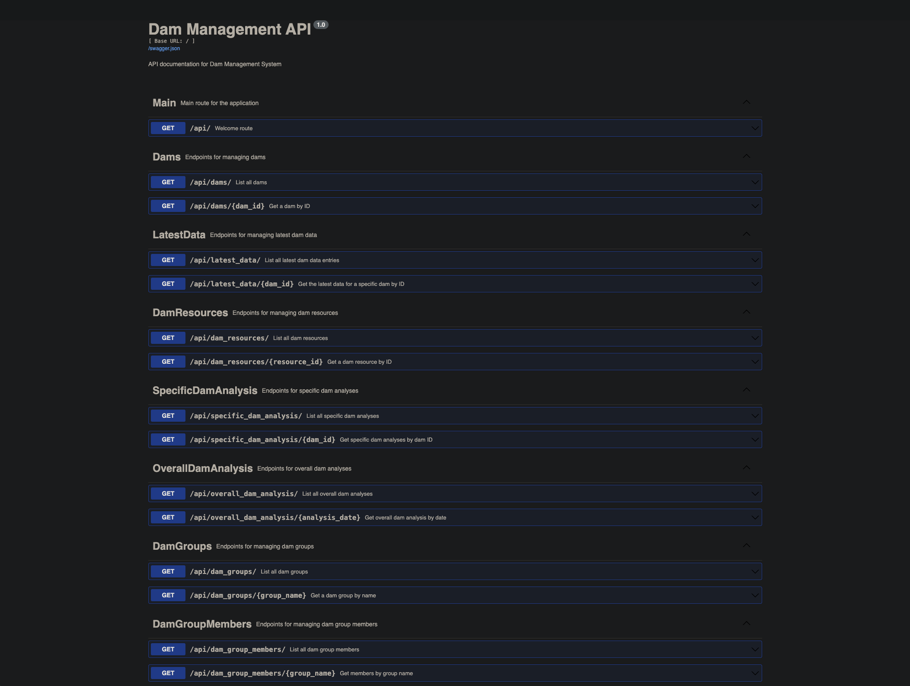
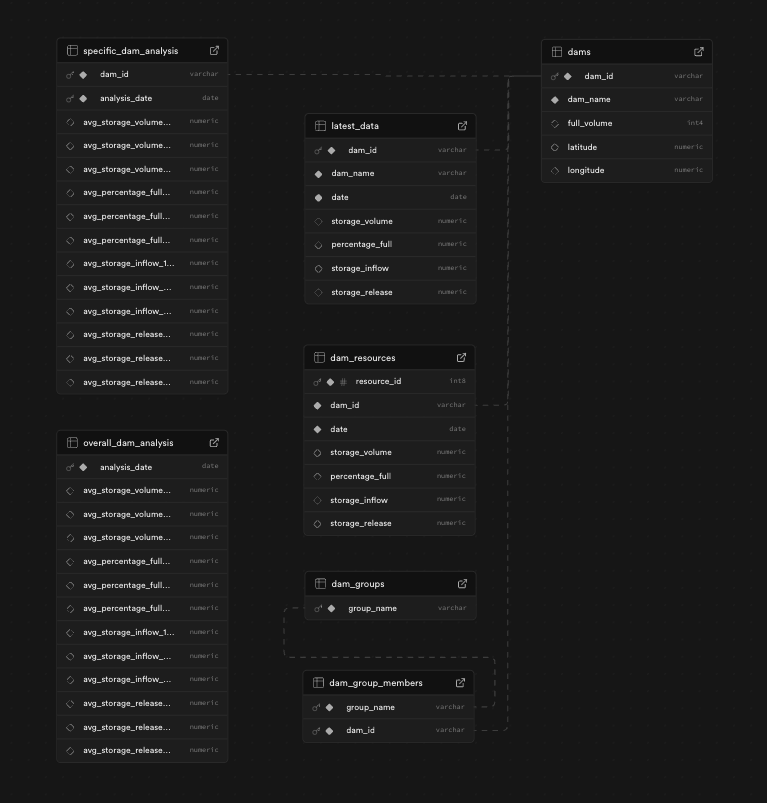

# Water Dashboard NSW

## Project Overview
A full-stack platform for monitoring dam water resources across New South Wales, Australia. Features a React dashboard, Flask REST API, and flexible database support for MySQL and PostgreSQL.

## Live Deployment

- [Live Deployment](https://frontend-water-dashboard-nsw.netlify.app/)

## Project Links

- [Frontend](https://github.com/obj809/frontend-water-dashboard-nsw)
- [Backend](https://github.com/obj809/backend-water-dashboard-nsw)
- [Local Database](https://github.com/obj809/local-db-water-dashboard-nsw)
- [Supabase](https://github.com/obj809/supabase-water-dashboard-nsw)

# Frontend – React Dashboard

https://github.com/obj809/frontend-water-dashboard-nsw

## Tech Stack
React 18, TypeScript, Vite, Redux Toolkit (RTK Query), React Router v6, Recharts, Chart.js, D3.js, SCSS, Vitest

## Project Features
- [x] Real-time data fetching with RTK Query caching
- [x] Search functionality and stacked-pages navigation
- [x] Interactive visualizations (Recharts, Chart.js, D3)
- [x] Full-screen graph views and dam detail pages

# Backend - Flask API
https://github.com/obj809/backend-water-dashboard-nsw

## Tech Stack
Flask 3.1, Flask-RESTX, Flask-SQLAlchemy, Flask-Migrate, PostgreSQL/MySQL, pytest, Gunicorn

## Project Features
- [x] CRUD operations with geolocation data
- [x] Historical time-series data with date filtering
- [x] Multi-period analysis (12-month, 5-year, 20-year averages)
- [x] Interactive Swagger UI and CI/CD with GitHub Actions

# Database – MySQL & Supabase PostgreSQL

Local database:
https://github.com/obj809/local-db-water-dashboard-nsw

Supabase:
https://github.com/obj809/supabase-water-dashboard-nsw

## Tech Stack
Python 3, MySQL 8.0+, PostgreSQL (Supabase), Pandas, OpenPyXL, psycopg2-binary

## Project Features
- [x] NSW dams with metadata, coordinates, and grouping system
- [x] 24-month historical snapshots with time-series data
- [x] Rolling average analysis (12-month, 5-year, 20-year)

## Contact Me
- Visit my [LinkedIn](https://www.linkedin.com/in/obj809/) for more details.
- Check out my [GitHub](https://github.com/cyberforge1) for more projects.
- Or send me an email at obj809@gmail.com
 
Thanks for your interest in this project. Feel free to reach out with any thoughts or questions.
 
 
Oliver Jenkins © 2025